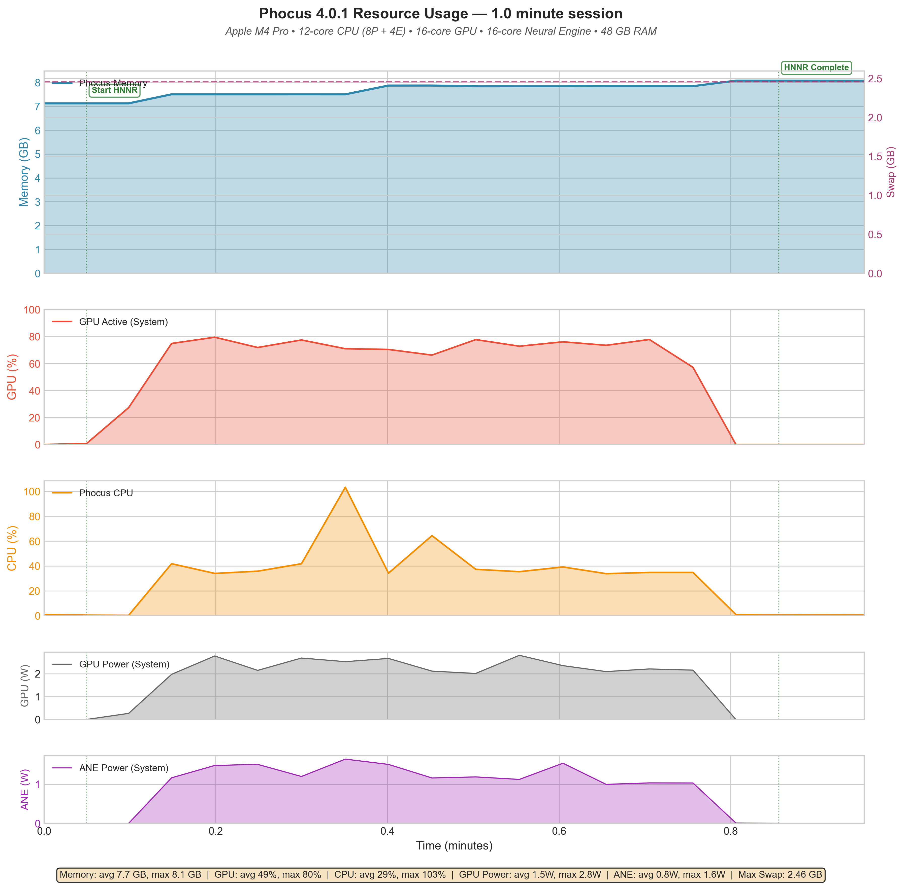
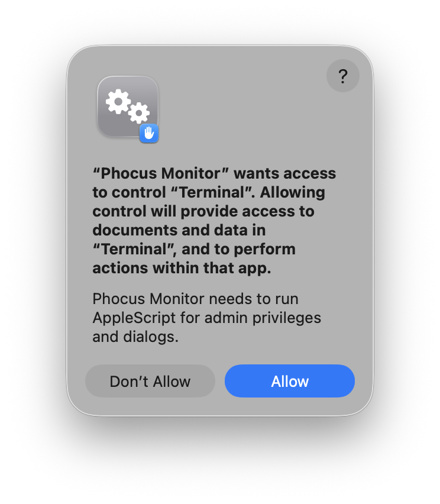

# Phocus Resource Monitor for Apple Silicon

A tool that monitors Hasselblad Phocus 4.x resource usage on Apple Silicon Macs, generating annotated graphs showing memory, CPU, GPU, and Neural Engine activity.

## What This Tool Does

This tool watches Phocus in the background and records:

- **Memory usage** (Phocus-specific) — How much RAM Phocus is consuming
- **CPU usage** (Phocus-specific) — How hard Phocus is working your processor
- **GPU utilization** (system-wide) — Graphics processor activity percentage
- **GPU power draw** (system-wide) — How much power the GPU is consuming
- **Neural Engine power** (system-wide) — Apple's ML hardware activity (confirms HNNR uses the ANE!)
- **Swap usage** (system-wide) — How much disk is being used as overflow memory

When you stop monitoring, it generates a publication-ready graph with all this data, plus a CSV file for further analysis.



*Example: Monitoring HNNR (Hasselblad Neural Network Noise Reduction) on an M4 Pro MacBook. Note the Neural Engine activity in the bottom panel — this confirms HNNR is using Apple's dedicated ML hardware.*

### Why "System-Wide" for Some Metrics?

macOS doesn't expose per-application GPU or Neural Engine usage. Memory and CPU are definitely Phocus-specific, but GPU and ANE reflect your whole system. For best results, close other apps during testing.

---

## Option 1: Using the App (Recommended)

The easiest way to run Phocus Monitor is with the launcher app, which provides a graphical interface.

### First-Time Setup

Before using the app, you need to set up the monitoring script:

1. **Download this repository** (click the green "Code" button → "Download ZIP", then extract it, or use `git clone`)

2. **Open Terminal** (press `Cmd + Space`, type "Terminal", press Enter)

3. **Navigate to the folder and set up Python:**
   ```bash
   cd ~/Downloads/phocus-monitor
   python3 -m venv .venv
   .venv/bin/pip install -r requirements.txt
   ```

   **What these commands do:**
   - `cd ~/Downloads/phocus-monitor` — navigates to the folder you downloaded
   - `python3 -m venv .venv` — creates a "virtual environment," an isolated space for this project's Python packages that won't affect anything else on your system
   - `.venv/bin/pip install -r requirements.txt` — installs two packages into the virtual environment:
     - **psutil** — reads process information (memory, CPU usage) from macOS
     - **matplotlib** — generates the graphs

That's it! The app will find this installation automatically.

### Running the App

1. **Open Phocus** (the app monitors an already-running Phocus)

2. **Double-click `Phocus Monitor.app`** (located in `app/dist/`)

3. **On first run**, macOS will ask for permission to control Terminal. Click **Allow**:

   

   This is required because the app launches a Terminal window to run the monitoring script with administrator privileges. The app does not access your documents or data — it only sends commands to Terminal.

4. **Follow the prompts:**
   - Choose where to save the output files
   - Optionally enter a duration in seconds (or leave blank to stop manually)
   - Click OK to start

5. **Enter your Mac password** in the Terminal window that opens (required for reading GPU and Neural Engine metrics)

6. **Add annotations** by pressing Enter in the Terminal and typing what you're about to do (e.g., "HNNR start - 3 images")

7. **Stop monitoring** — If you set a duration, the script will stop automatically and generate the graph. Otherwise, press **Control+C** (not Command+C) in the Terminal window to stop and generate the graph.

---

## Option 2: Using the Command Line

For users comfortable with Terminal, you can run the script directly.

### Requirements

- **macOS** on Apple Silicon (M1, M2, M3, M4 series)
- **Phocus 4.x** installed
- **Python 3.9+** (included on macOS)
- **Administrator access** (the script needs `sudo` to read hardware metrics)

### Installation

1. **Open Terminal** and navigate to where you want to save the script:
   ```bash
   cd ~/Downloads
   ```

2. **Clone the repository** (or download and extract the ZIP):
   ```bash
   git clone https://github.com/kmichels/phocus-monitor.git
   cd phocus-monitor
   ```

3. **Set up the Python environment:**
   ```bash
   python3 -m venv .venv
   .venv/bin/pip install -r requirements.txt
   ```

### Running the Script

1. **Open Phocus** (the script monitors an already-running Phocus)

2. **Run the script with sudo:**
   ```bash
   sudo .venv/bin/python3 monitor_phocus.py
   ```

3. **Enter your Mac password** when prompted. (You need `sudo` because reading GPU and Neural Engine data requires administrator privileges.)

4. **The script will start monitoring.** You'll see output like:
   ```
   ╔════════════════════════════════════════════════╗
   ║   Phocus Resource Monitor v2.5.1              ║
   ╚════════════════════════════════════════════════╝

     System: Apple M4 Pro
       CPU: 14 cores (10P + 4E)
       GPU: 20 cores
       ANE: 16-core Neural Engine
       RAM: 64 GB

     Phocus: v4.0.1

     Interval: 2.0s
     Output: phocus_monitor_20241210_143052.*

     Controls:
       Press Enter to add an annotation
       Press Ctrl+C to stop and generate graph
   ```

5. **Add annotations** by pressing Enter and typing what you're about to do:
   ```
   > HNNR start - 3 images
   ```
   These labels appear on your graph, helping you remember what was happening at each point.

6. **Perform your Phocus operations** — import images, apply HNNR, browse thumbnails, whatever you want to measure.

7. **Stop monitoring.** If you used `--duration`, the script stops automatically. Otherwise, press **Control+C** (not Command+C) to stop. Either way, the script will generate:
   - A PNG graph file (e.g., `phocus_monitor_20241210_143052.png`)
   - A CSV data file (e.g., `phocus_monitor_20241210_143052.csv`)

### Command Line Options

```bash
sudo .venv/bin/python3 monitor_phocus.py [options]
```

| Option | Default | Description |
|--------|---------|-------------|
| `--duration SECONDS` | unlimited | Stop automatically after this many seconds |
| `--interval SECONDS` | 2.0 | How often to sample (lower = more detail, larger files) |
| `--output PATH` | auto-generated | Output path: directory or full path (see examples) |
| `--version` | — | Show version and exit |

**Examples:**

```bash
# Monitor for exactly 5 minutes
sudo .venv/bin/python3 monitor_phocus.py --duration 300

# Sample every half-second for detailed analysis
sudo .venv/bin/python3 monitor_phocus.py --interval 0.5

# Specify output filename (saves as hnnr_test_run1.png and .csv)
sudo .venv/bin/python3 monitor_phocus.py --output hnnr_test_run1

# Specify output directory (uses default timestamped name in that directory)
sudo .venv/bin/python3 monitor_phocus.py --output ~/Documents/phocus-tests/

# Full path with filename
sudo .venv/bin/python3 monitor_phocus.py --output ~/Documents/phocus-tests/my_test
```

**Note:** If you specify a directory that doesn't exist, the script will ask if you want to create it.

---

## Understanding the Output

The generated graph has 5 panels:

1. **Memory (GB)** — Phocus RAM usage (blue) and system swap (orange, right axis)
2. **GPU Active (%)** — System-wide GPU utilization
3. **CPU (%)** — Phocus CPU usage (100% = 1 full core, 200% = 2 cores, etc.)
4. **GPU Power (W)** — System-wide GPU power consumption
5. **ANE Power (W)** — Neural Engine power (spikes during HNNR confirm ML hardware usage!)

Vertical dashed lines show your annotations.

The summary bar at the bottom shows averages and maximums for each metric.

---

## Troubleshooting

### "Phocus is not running"

Start Phocus before running the script or app. The monitor watches an already-running Phocus process.

### "Permission denied" or no GPU/ANE data

Make sure you're running with `sudo` (command line) or entering your password when prompted (app).

### "No module named psutil" or "No module named matplotlib"

The virtual environment isn't set up or the packages aren't installed. Run:
```bash
cd ~/Downloads/phocus-monitor
python3 -m venv .venv
.venv/bin/pip install -r requirements.txt
```

### The app shows "Setup Required"

The app couldn't find the phocus-monitor installation. Make sure you've:
1. Downloaded/cloned the repository
2. Created the virtual environment with `python3 -m venv .venv`
3. Installed dependencies with `.venv/bin/pip install -r requirements.txt`

The app looks in these locations:
- `~/phocus-monitor`
- `~/Downloads/phocus-monitor`
- `~/Documents/phocus-monitor`
- The folder containing the app

### The graph looks weird or has missing data

- **GPU/ANE all zeros?** Make sure you're using `sudo` or entering your password
- **Memory seems too high?** Phocus caches images aggressively. This is normal — see our findings about memory accumulation during browsing.

---

## Tips for Good Data

1. **Close other apps** — GPU and ANE are system-wide metrics, so other apps will add noise
2. **Use annotations liberally** — It's hard to remember what you were doing at timestamp 3:42
3. **Let things settle** — Wait a few seconds between operations so you can see clear boundaries in the graph
4. **Longer sessions = clearer patterns** — 3-5 minute sessions work well

---

## Uninstalling

This tool doesn't install anything system-wide — everything is contained in the project folder. To completely remove it:

```bash
# Delete the entire project folder (includes venv and all dependencies)
rm -rf ~/Downloads/phocus-monitor
```

That's it. The virtual environment (`.venv/`) contains all the Python packages, so deleting the folder removes everything.

If you want to keep your output files:
```bash
# Keep only your CSV and PNG files
cd ~/Downloads/phocus-monitor
cp *.csv *.png ~/Desktop/  # or wherever you want them
cd ..
rm -rf phocus-monitor
```

---

## Contributing

Found a bug? Have an idea? Open an issue or PR on GitHub.

This tool was developed as part of a documentation project for Hasselblad Phocus. Read more at [tonalphoto.com](https://tonalphoto.com).

---

## License

MIT License — see [LICENSE](LICENSE) for details.
